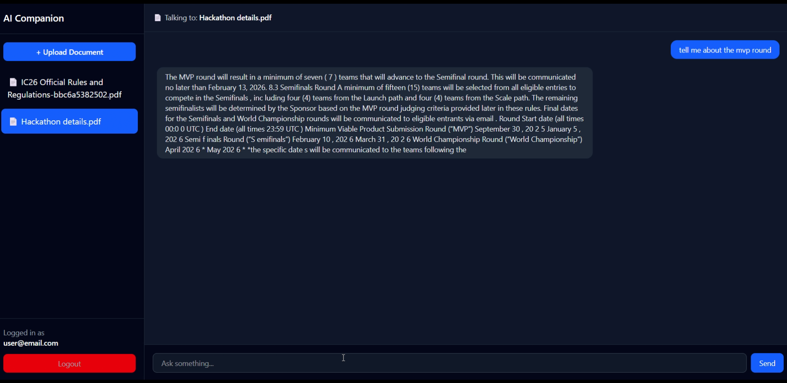

# 🧠 AI Knowledge Companion (RAG-based System)

An AI-powered document assistant that enables users to upload PDF and DOCX files and interact with them using natural language queries.

The system uses Retrieval-Augmented Generation (RAG) with semantic search to retrieve the most relevant document context before generating responses.

---

## 🚀 Features

* 📄 Upload and process PDF/DOCX documents
* 🔍 Semantic search using FAISS vector database
* 🤖 Context-aware answers using FLAN-T5
* 💬 ChatGPT-style conversational interface
* 🔐 User-specific document isolation with JWT authentication
* ⚡ Optimized retrieval pipeline for efficient response generation
* 🛡️ Hallucination-aware response handling

---

## 🧠 How It Works (RAG Pipeline)

1. User uploads a document
2. Text extraction and preprocessing
3. Document chunking
4. Embedding generation using SentenceTransformers
5. Embeddings stored in FAISS vector index
6. User query converted into embedding
7. Top relevant chunks retrieved from FAISS
8. Retrieved context injected into prompt
9. FLAN-T5 generates final response

---

## 🛡️ Hallucination Control

The assistant generates responses strictly from retrieved document context.

If relevant information is not found in the uploaded document, the system avoids generating unsupported or hallucinated responses.

This improves reliability and keeps answers grounded in the document content.

---

## 🏗️ Architecture Overview

```text
User
  ↓
React Frontend
  ↓
Node.js API Layer
  ↓
FastAPI AI Service
  ↓
SentenceTransformers → FAISS Retrieval
  ↓
Retrieved Context
  ↓
FLAN-T5 Response Generation
```

---

## 🏗️ Tech Stack

### Frontend

* React.js / Next.js
* Tailwind CSS

### Backend

* Node.js
* Express.js
* FastAPI

### AI / ML

* SentenceTransformers
* FAISS
* FLAN-T5

### Database

* MongoDB (metadata and document storage)

---

## ⚙️ Key Engineering Decisions

* ✅ Paragraph-based chunking for better semantic retrieval
* ✅ File-specific FAISS indexing for isolated retrieval
* ✅ Context limiting to reduce unnecessary token usage
* ✅ Efficient retrieval pipeline focused on response speed and relevance
* ❌ Avoided heavy reranking models to keep latency low for smaller datasets
* ⚖️ Balanced trade-off between retrieval quality and performance

---

## ⚡ Performance Optimizations

* Optimized token usage for faster inference
* Efficient FAISS retrieval with low-latency vector search
* Reusable embedding storage to avoid unnecessary recomputation

---

## 🧪 Example Queries

* "List technologies mentioned in the document"
* "Summarize the project requirements"
* "Tell me about all the rounds of the hackathon"
* "What are the key responsibilities mentioned?"

---

## 📂 Project Structure

```text
frontend/      → React frontend
backend/       → Node.js APIs
ai-service/    → FastAPI + RAG pipeline
assets/        → Screenshots and demo assets
```

---

## 📸 Screenshots

### Dashboard UI



---

## 🎥 Demo

Add your LinkedIn demo post or demo video link here.

```md
[Demo Video](https://www.linkedin.com/posts/akshat-jain-1a71b4376_ai-rag-llm-ugcPost-7459668572227788800-3Z9d?utm_source=share&utm_medium=member_desktop&rcm=ACoAAFzvAw8BjNgvlF2ili6R4KPZIcaG7D1HUNA)
```

---

## 🛠️ Setup Instructions

### 1. Clone the Repository

```bash
git clone https://github.com/akshat-jain-01/AI-Knowledge-Companion.git
cd AI-Knowledge-Companion
```

### 2. Install Dependencies

#### Backend

```bash
npm install
```

#### AI Service

```bash
pip install -r requirements.txt
```

---

### 3. Configure Environment Variables

Create a `.env` file in the backend directory:

```env
AI_SERVICE_BASE_URL=http://localhost:8000
MONGO_URI=your_mongodb_uri
JWT_SECRET=your_secret_key
```

---

### 4. Run Backend Server

```bash
npm run dev
```

---

### 5. Run FastAPI AI Service

```bash
uvicorn app:app --reload --port 8000
```

---

## 📌 Future Improvements

* Better retrieval ranking and context filtering
* Query rewriting for improved retrieval quality
* Multi-document conversational memory
* Streaming responses for improved UX
* Hybrid search (BM25 + vector search)
* Advanced reranking models
* Improved response grounding and hallucination detection

---

## 🙌 Author

**Akshat Jain**

📧 [akshatjainkht01@gmail.com](mailto:akshatjainkht01@gmail.com)
🔗 GitHub: https://github.com/akshat-jain-01
🔗 LinkedIn: https://linkedin.com/in/akshat-jain-1a71b4376
